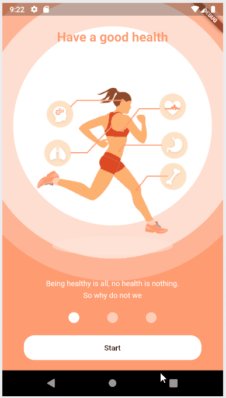
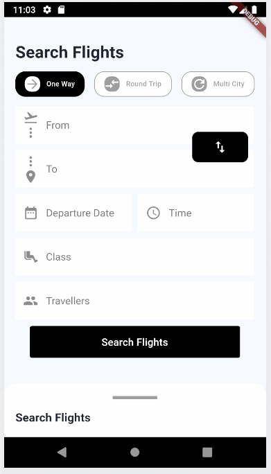
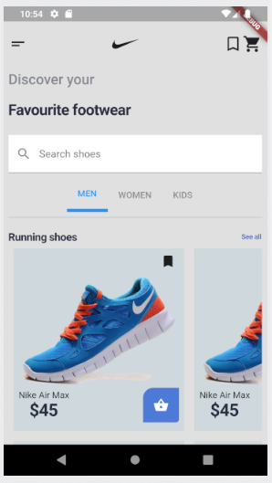

# Flutter UI Challenges

# Click on the Image to go to the Project

Onboarding Example 

Here is an example of how to develop it, https://youtu.be/D2OuOUMR-u4

UI reference - https://www.xdguru.com/cafit-gym-workout-mobile-ui-kit/

Flights App

UI reference - https://www.xdguru.com/flight-app-free-xd-ui-kit/

NikeUI App

UI reference - https://www.uplabs.com/posts/nike-app-redesign-concept

Thanks.
